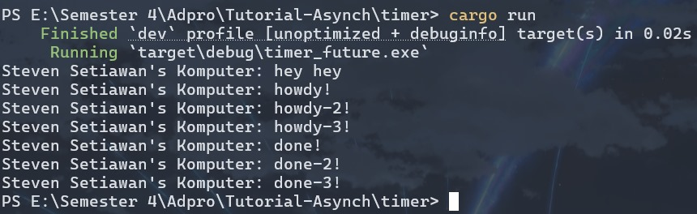
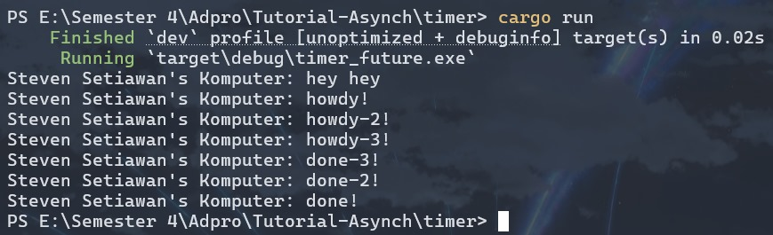
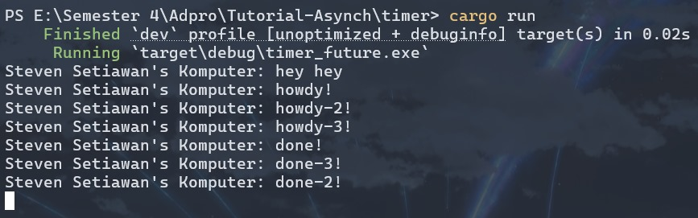

# Reflection

## Understanding How It Works

Pesan baru yaitu "Steven Setiawan's Komputer: hey hey" muncul paling pertama dibandingkan dengan pesan lainnya karena berada langsung di fungsi `main()` yang dieksekusi secara sinkronus. Kemudian, pesan "Steven Setiawan's Komputer: howdy!" muncul kedua karena berada dalam fungsi `async` yang dijalankan oleh _spawner_ sebagai task terpisah yang harus menunggu giliran dieksekusi oleh _executor_. Setelah pesan "howdy!" ditampilkan, eksekusi _task async_ dihentikan sementara oleh `TimerFuture::new(Duration::new(2, 0)).await` yang membuat _task_ berhenti selama 2 detik. Setelah masa tunggu tersebut selesai, task ini dilanjutkan kembali oleh _executor_ dan akhirnya mencetak "Steven Setiawan's Komputer: done!". Urutan eksekusi ini menunjukkan bagaimana program Rust ini dapat menangani operasi asinkronus tanpa memblokir _thread_ utama yang kita miliki.

## Multiple Spawn and Removing Drop

Sama seperti sebelumnya, pesan "hey hey" muncul pertama di layar sebelum semua perintah `print` yang berada dalam fungsi _async_. Kemudian, semua pesan "howdy!" dicetak berurutan sebelum munculnya pesan "done!" manapun karena _task-task_ yang dibuat _spawner_ berjalan secara asinkronus dan tidak perlu menunggu tugas sebelumnya selesai. Ini memperlihatkan bagaimana beberapa operasi asinkronus dapat dimulai dalam waktu yang hampir bersamaan sebelum salah satunya menyelesaikan waktu tunggunya.

Pada kasus dengan `drop`, program akan menampilkan semua pesan "howdy!" terlebih dahulu, lalu berhenti sejenak, kemudian baru menampilkan semua pesan "done!" sebelum program berakhir. Hal ini terjadi karena perintah `drop(spawner)` memberitahu _executor_ bahwa tidak akan ada lagi tugas baru, sehingga _executor_ dapat menyelesaikan semua tugas yang sedang berjalan. Jeda yang terjadi sendiri masih sama seperti sebelumnya (disebabkan oleh `TimerFuture::new(Duration::new(2, 0)).await`).

Tanpa menggunakan `drop`, program hanya menampilkan semua pesan "howdy!", lalu "done", dan kemudian terus berjalan tanpa pernah berhenti. Hal ini dikarenakan _executor_ terus-menerus menunggu tugas-tugas baru karena tidak ada yang memberitahunya bahwa tidak akan ada lagi tugas yang ditambahkan. Tanpa adanya `drop(spawner)`, _executor_ tidak tahu kapan harus berhenti mendengarkan tugas baru, yang mengakibatkan program tetap berjalan dalam kondisi _waiting_ tanpa akhir.