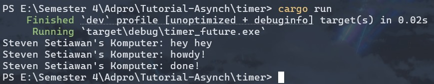

# Reflection

## Understanding How It Works

Pesan baru yaitu "Steven Setiawan's Komputer: hey hey" muncul paling pertama dibandingkan dengan pesan lainnya karena berada langsung di fungsi `main()` yang dieksekusi secara sinkronus. Kemudian, pesan "Steven Setiawan's Komputer: howdy!" muncul kedua karena berada dalam fungsi `async` yang dijalankan oleh _spawner_ sebagai task terpisah yang harus menunggu giliran dieksekusi oleh _executor_. Setelah pesan "howdy!" ditampilkan, eksekusi _task async_ dihentikan sementara oleh `TimerFuture::new(Duration::new(2, 0)).await` yang membuat _task_ berhenti selama 2 detik. Setelah masa tunggu tersebut selesai, task ini dilanjutkan kembali oleh _executor_ dan akhirnya mencetak "Steven Setiawan's Komputer: done!". Urutan eksekusi ini menunjukkan bagaimana program Rust ini dapat menangani operasi asinkronus tanpa memblokir _thread_ utama yang kita miliki.